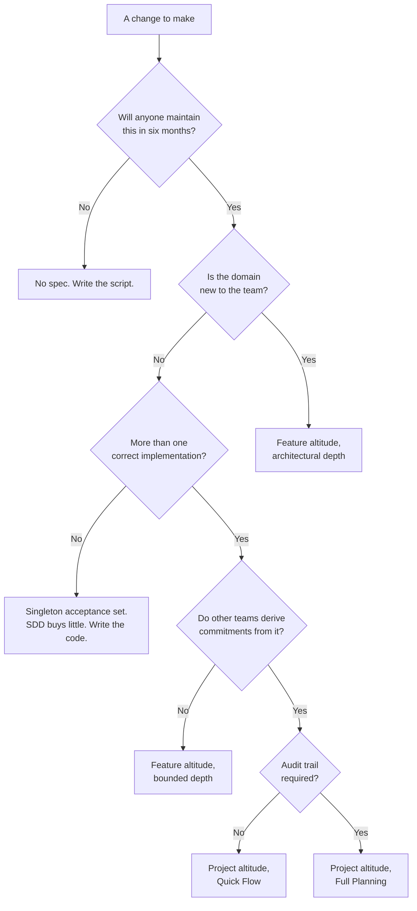

# SDD Training Slidev Deck Implementation Plan

> **For agentic workers:** REQUIRED SUB-SKILL: Use superpowers:subagent-driven-development (recommended) or superpowers:executing-plans to implement this plan task-by-task. Steps use checkbox (`- [ ]`) syntax for tracking.

**Goal:** Build the ~103-slide Slidev deck that delivers all seven modules of the one-day SDD training, in English, rendering correctly in both light and dark themes and exporting to PDF.

**Architecture:** One Slidev project, `sdd-training`, using the same stack as the existing `agentic-prep` deck so the author's tooling knowledge transfers. Slides live in `slides.md` with per-module partials under `pages/` imported via `src:`, which keeps each module editable in isolation and each file small enough to hold in context. A Node-based `verify` script asserts the structural invariants the design depends on — slide counts per module, presence of the load-bearing tables, and absence of any back-reference to a parked pre-read slide.

**Tech Stack:** Slidev `^52`, `@slidev/theme-default`, Node 20+, Mermaid (built into Slidev) for the module 6 decision flowchart.

**Spec:** `docs/superpowers/specs/2026-08-30-sdd-training-design.md` — §4 module breakdowns drive slide content; §2.0, §2.2, §2.3 and §11 are enforced as invariants by the verify script.

## Global Constraints

- **Language:** every slide, speaker note, comment and commit message in English. Delivery is spoken in Turkish; the deck is not.
- **Slide budget per module,** enforced by `scripts/verify.mjs`: M0 = 14, M1 = 15, M2 = 14, M3 = 15, M4 = 18, M5 = 14, M6 = 13. Total 103.
- **§11 invariant — nothing may depend on the pre-read.** No slide in modules 0–6 may reference Model, Prompt, Tools, Standard Out, Types or Architecture as prior knowledge. The verify script greps for these as back-references.
- **§2.3 invariant — principle before tool.** In modules 2, 3 and 4, the slide introducing a principle must precede the first slide naming BMAD or Superpowers. Enforced by slide ordering assertions.
- **Every module opens with its damage slide** (§2.1). Slide 1 of each module partial carries the failure, not the agenda.
- **Speaker notes are mandatory** on every slide carrying an argument, written as `<!-- ... -->` after the slide body. The facilitator delivers in Turkish from English notes; notes must be complete sentences, not keywords.
- **Two themes.** Every slide must be legible in light and dark. Never hard-code a colour without its `dark:` variant.
- **No slide may exceed the viewport.** Verified by the export step in Task 11.
- **Commits:** one per task, prefixed `deck:`.

---

## File Structure

| Path | Responsibility |
|---|---|
| `package.json` | Slidev scripts: `dev`, `build`, `export`, `verify` |
| `slides.md` | Front matter, title slide, and `src:` imports of every module partial |
| `pages/00-bridge.md` | Module 0 — Bridge Cut (9) + mindset switch (5) = 14 slides |
| `pages/01-spec-anatomy.md` | Module 1 — 15 slides |
| `pages/02-elicitation.md` | Module 2 — 14 slides |
| `pages/03-plans.md` | Module 3 — 15 slides |
| `pages/04-verification.md` | Module 4 — 18 slides |
| `pages/05-brownfield.md` | Module 5 — 14 slides |
| `pages/06-antipatterns.md` | Module 6 — 13 slides |
| `pre-read/pre-read.md` | The 9 parked `agentic-prep` slides, shipped separately. Never imported by `slides.md`. |
| `scripts/verify.mjs` | Structural invariant checks |
| `styles/index.css` | Shared table and callout styling, both themes |

Splitting by module rather than by slide type means the files that change together live together: revising module 4's backward-edge argument touches exactly one file.

---

## Task 1: Slidev scaffold with a verification harness

**Files:**
- Create: `sdd-training/package.json`
- Create: `sdd-training/slides.md`
- Create: `sdd-training/scripts/verify.mjs`
- Create: `sdd-training/styles/index.css`
- Create: `sdd-training/.gitignore`

**Interfaces:**
- Consumes: nothing.
- Produces: `npm run verify` exits 0 or 1 with a per-module slide-count report; `npm run dev` serves the deck. `scripts/verify.mjs` exports nothing — it is a CLI. Every later task adds cases to it.

- [ ] **Step 1: Scaffold the project**

```bash
mkdir -p sdd-training/pages sdd-training/scripts sdd-training/styles sdd-training/pre-read
cd sdd-training && git init
npm init -y
npm install -D @slidev/cli@^52 @slidev/theme-default@^0.25
```

- [ ] **Step 2: Write the failing verify script**

Create `scripts/verify.mjs`:

```javascript
import { readFileSync, existsSync } from 'node:fs'
import { join } from 'node:path'

const EXPECTED = {
  '00-bridge.md': 14,
  '01-spec-anatomy.md': 15,
  '02-elicitation.md': 14,
  '03-plans.md': 15,
  '04-verification.md': 18,
  '05-brownfield.md': 14,
  '06-antipatterns.md': 13,
}

const PARKED = ['Standard Out', 'leverage point #11', 'leverage point #10', 'leverage point #9', 'leverage point #7', 'leverage point #4']

let failed = 0
const fail = (msg) => { console.error(`FAIL  ${msg}`); failed++ }
const pass = (msg) => console.log(`ok    ${msg}`)

// Slidev separates slides with a line that is exactly ---
const countSlides = (text) =>
  text.split('\n').filter((l) => l.trim() === '---').length

let total = 0
for (const [file, expected] of Object.entries(EXPECTED)) {
  const path = join('pages', file)
  if (!existsSync(path)) { fail(`${file} is missing`); continue }
  const n = countSlides(readFileSync(path, 'utf8'))
  total += n
  if (n === expected) pass(`${file}: ${n} slides`)
  else fail(`${file}: ${n} slides, expected ${expected}`)
}

if (total === 103) pass(`total: ${total} slides`)
else fail(`total: ${total} slides, expected 103`)

// Spec §11: nothing in the day may depend on the pre-read
for (const [file] of Object.entries(EXPECTED)) {
  const path = join('pages', file)
  if (!existsSync(path)) continue
  const text = readFileSync(path, 'utf8')
  for (const term of PARKED) {
    if (text.includes(term)) fail(`${file} back-references parked pre-read material: "${term}"`)
  }
}
pass('spec §11: no back-references to parked pre-read slides')

process.exit(failed ? 1 : 0)
```

- [ ] **Step 3: Run verify to confirm it fails**

Run: `node scripts/verify.mjs`
Expected: FAIL — all seven page files missing, exit code 1.

- [ ] **Step 4: Write `package.json` scripts**

Replace the `"scripts"` block in `package.json`:

```json
{
  "scripts": {
    "dev": "slidev --open",
    "build": "slidev build",
    "export": "slidev export --format pdf --output dist/sdd-training.pdf",
    "verify": "node scripts/verify.mjs"
  }
}
```

- [ ] **Step 5: Write the deck entry point**

Create `slides.md`:

```markdown
---
theme: default
title: "Spec-Driven Development"
info: |
  A one-day training for software developers.
  Delivered in Turkish; slides in English.
class: text-center
drawings:
  persist: false
transition: slide-left
mdc: true
fonts:
  sans: Inter
  mono: Fira Code
---

# Spec-Driven Development

Where does the truth about your system live?

<div class="pt-8 opacity-75 text-sm">
One day. Seven modules. One question, asked three times.
</div>

<!--
Do not open with an agenda. Open with the question, then module 0's damage slide.
The agenda arrives at the end of module 0, once the room knows why it needs one.
-->

---
src: ./pages/00-bridge.md
---

---
src: ./pages/01-spec-anatomy.md
---

---
src: ./pages/02-elicitation.md
---

---
src: ./pages/03-plans.md
---

---
src: ./pages/04-verification.md
---

---
src: ./pages/05-brownfield.md
---

---
src: ./pages/06-antipatterns.md
---
```

- [ ] **Step 6: Write shared styles**

Create `styles/index.css`:

```css
.slidev-layout table { font-size: 0.85rem; line-height: 1.35; }
.slidev-layout table td, .slidev-layout table th { padding: 0.25rem 0.5rem; }

.callout-bad  { @apply p-3 rounded-lg bg-red-50   dark:bg-red-900/20   border-l-4 border-red-400; }
.callout-good { @apply p-3 rounded-lg bg-green-50 dark:bg-green-900/20 border-l-4 border-green-400; }
.callout-key  { @apply p-3 rounded-lg bg-blue-50  dark:bg-blue-900/20  border-l-4 border-blue-400; }
```

- [ ] **Step 7: Commit**

```bash
git add .
git commit -m "deck: scaffold Slidev project with slide-count verification"
```

---

## Task 2: Module 0 — the Bridge Cut (9 slides)

**Files:**
- Create: `pages/00-bridge.md` (first 9 slides only; Task 3 appends 5 more)
- Reference: `/Users/mac/workspace/test/agentic-prep/slides-tr.md`

**Interfaces:**
- Consumes: the scaffold from Task 1.
- Produces: slides 1–9 of module 0. Task 3 appends to the same file and must not renumber these.

The existing `agentic-prep` deck is in Turkish. This task translates the nine kept slides to English and drops the nine parked ones (Model, Prompt, Tools, Standard Out, Types, Architecture) per spec §0 and §11.

- [ ] **Step 1: Write the damage slide and the leverage hierarchy**

Create `pages/00-bridge.md`:

```markdown
# The agent built the wrong thing

<div class="mt-8 text-2xl opacity-90">Flawlessly.</div>

<div class="mt-12 grid grid-cols-2 gap-6">
  <div class="callout-bad">
    <div class="font-bold text-red-600 dark:text-red-400">What we reviewed</div>
    <div class="text-sm mt-1">2,400 lines of clean, tested, idiomatic code</div>
  </div>
  <div class="callout-good">
    <div class="font-bold text-green-600 dark:text-green-400">What nobody reviewed</div>
    <div class="text-sm mt-1">The three sentences that told it what to build</div>
  </div>
</div>

<!--
Open cold. No agenda slide, no introductions beyond your name.
Ask the room by show of hands: who has shipped something correct that was
not what was wanted? Every hand goes up. That is the day's subject.
-->

---

<h1 class="!text-xl">Twelve leverage points</h1>

<p class="!text-xs !leading-tight opacity-75">From Donella Meadows' systems theory. Changes near the top cascade through the whole system; changes at the bottom stay local. Today operates points 1, 2, 3, 5, 6 and 12.</p>

| # | Leverage point | The question |
|---|---|---|
| 12 | **Context** | What does the agent actually know? |
| 11 | Model | Cost, speed, intelligence tradeoffs? |
| 10 | Prompt | Are the instructions concrete? |
| 9 | Tools | Which actions, in what form? |
| 8 | Standard Out | Can anyone see what happened? |
| 7 | Types | Is typing consistent and enforced? |
| 6 | **Documentation** | Can agents navigate it? |
| 5 | **Tests** | Help, or theatre? |
| 4 | Architecture | Is it agentically intuitive? |
| 3 | **Plans** | Can they complete without more input? |
| 2 | **Templates** | What does good output look like? |
| 1 | **ADWs** | How does work flow? |

<!--
Do not teach all twelve. Name the six in bold as today's territory and say
plainly that the other six ship as optional reading. The room does not need
them and saying so buys credibility for everything that follows.
-->
```

- [ ] **Step 2: Write the six kept leverage-point slides**

Append six slides to `pages/00-bridge.md`, one each for #12 Context, #6 Documentation, #5 Tests, #3 Plans, #2 Templates, #1 ADWs. Translate the corresponding slides from `agentic-prep/slides-tr.md` into English, keeping the bad/good two-column callout structure already used there and reusing the `.callout-bad` / `.callout-good` classes from `styles/index.css`.

Each keeps its Turkish original's argument but gains one sentence tying it to specs — for example, on #12 Context: *"A spec is the highest signal-to-noise context you can hand an agent."*

- [ ] **Step 3: Write the connections slide**

Append the ninth slide, adapting the "Bağlantılar" slide from `slides-tr.md`: a four-cell grid covering Core Four, system patterns, evaluation, and the Meadows source.

- [ ] **Step 4: Verify the partial count**

Run: `node scripts/verify.mjs`
Expected: FAIL, reporting `00-bridge.md: 9 slides, expected 14`. Every other page still missing. This is the correct intermediate state.

- [ ] **Step 5: Commit**

```bash
git add .
git commit -m "deck: module 0 Bridge Cut, nine slides from agentic-prep in English"
```

---

## Task 3: Module 0 — the mindset switch (5 slides)

**Files:**
- Modify: `pages/00-bridge.md` — append 5 slides
- Modify: `scripts/verify.mjs` — assert the through-line table exists

**Interfaces:**
- Consumes: slides 1–9 from Task 2.
- Produces: slides 10–14, bringing `00-bridge.md` to 14. Modules 4 and 5 reference the deletion test by the wording fixed here.

Spec §4 Module 0 beat 4. This is the beat the rest of the day leans on, and the one §5 marks never-cut.

- [ ] **Step 1: Append the phoenix framing slide with the honest history**

```markdown
---

# Rebuilding from a definition

<div class="grid grid-cols-2 gap-6 mt-6">
  <div class="callout-bad">
    <div class="font-bold text-red-600 dark:text-red-400">Snowflake</div>
    <div class="text-sm mt-1">Patched in place until nobody dares touch it</div>
  </div>
  <div class="callout-good">
    <div class="font-bold text-green-600 dark:text-green-400">Phoenix</div>
    <div class="text-sm mt-1">Destroyed and rebuilt from its definition</div>
  </div>
</div>

<div class="mt-8 text-sm opacity-90">

Infrastructure settled this a decade ago. **Code has had the argument before — and lost it twice.**

- CASE tools and 4GLs, late 1980s
- MDA and round-trip UML, 2001–2008 — regeneration was cheap *and* deterministic, and it still lost
- It quietly **won** wherever the definition covers a narrow slice completely: protobuf, OpenAPI clients, GraphQL types, ORM migrations

</div>

<div class="callout-key mt-6">
What changed is not the price of regeneration. It is the <b>medium of the definition</b> — natural language became executable, which widens the reachable slice from wire formats to behaviour. The price of that width is determinism.
</div>

<!--
Two minutes maximum on this slide. Someone in the room has lived MDA or 4GLs.
Claiming the argument never happened costs you the only thing this beat has,
which is credibility about why today is different. Say "lost it twice" out loud.
Cite Fowler, SnowflakeServer / PhoenixServer, 2012 — that is the one established
anchor. Do not present "regenerative architecture" as a named methodology.
-->

---

# The deletion test

<div class="text-xl mt-6">
If I deleted this module entirely, could I regenerate it — <b>correctly</b> — from its spec alone?
</div>

<div class="mt-6 text-sm opacity-75">Not "would the output be identical." Identity is not available and is not the point.</div>

<div class="callout-key mt-8">
<div class="font-bold">Ask it as an enumeration, not as a feeling:</div>
<div class="mt-2 text-lg">Name one thing you would have to know to rebuild this that the spec does not say.</div>
<div class="mt-2 text-sm opacity-75">If you can name one, it fails — and the thing you named is the backlog entry.</div>
</div>

<div class="mt-6 text-sm">Ask it in two sizes: <b>this module</b>, and <b>this boundary</b>. The knowledge least likely to be written down lives between modules.</div>

<!--
Run it in the room, ninety seconds. Laptops are open. Ask everyone to pull up a
repository they actually work on, pick one module, and silently name one thing.
Then: "hands up if you could NOT name one." Almost no hands go up. That is the
lesson, and it lands on their own code rather than on this slide.

Give anyone without a repo the running example instead of letting them sit out.
Do NOT collect answers publicly — naming a colleague's undocumented module in
front of the room converts insight into defensiveness. Show of hands only.

Say plainly that the test is literally runnable: delete it, hand a fresh agent
the spec, diff the behaviour.
-->

---

# What a failure means

<div class="text-lg mt-6">
The code holds knowledge that exists <b>nowhere else</b>.
</div>

<div class="mt-4 text-sm opacity-90">Every piece of it is a single point of failure living in one person's head — or in nobody's.</div>

<div class="callout-bad mt-10 !text-lg">
You have been maintaining the binary and calling it the source.
</div>

<div class="mt-10 grid grid-cols-2 gap-4 text-sm">
  <div class="callout-key">
    <div class="font-bold">It is a gradient, not a gate</div>
    <div class="mt-1">Almost nothing passes today. The questions are <i>what fraction</i> and <i>which knowledge</i>.</div>
  </div>
  <div class="callout-good">
    <div class="font-bold">Not every failure is debt</div>
    <div class="mt-1">Spec debt only when the missing knowledge is <b>intent or constraint</b>. When it is implementation judgment, the spec is right and the test is <i>supposed</i> to fail there.</div>
  </div>
</div>

<!--
The right-hand box is not optional. Without it participants go home and seed
their backlog with precision-budget residue, which is over-specification — an
anti-pattern module 6 names. It is also the earliest statement of module 4's
spec-defect / implementation-defect diagnostic.
-->

---

# The truth splits. It does not relocate.

<div class="grid grid-cols-2 gap-6 mt-10">
  <div class="callout-key">
    <div class="font-bold text-blue-600 dark:text-blue-400">Truth about intent</div>
    <div class="text-lg mt-2">moved to the spec</div>
  </div>
  <div class="callout-good">
    <div class="font-bold text-green-600 dark:text-green-400">Truth about this artifact</div>
    <div class="text-lg mt-2">never left the code, and never will</div>
  </div>
</div>

<div class="mt-10 text-lg">
So spec review is a review that was <b>missing</b> — not a review that replaces one.
</div>

<div class="mt-4 text-sm opacity-75">
And it is missing in the place where defects are cheapest to catch, which is where the least attention has historically been spent. That asymmetry is the whole shift.
</div>

<!--
Phrase this as a split, never as an either/or. Rooms keep climaxes and drop
caveats: an either/or here is what would make people stop reading diffs, seven
hours before module 4 has to undo it. Phrased as a split, module 4 beat 8
inherits this vocabulary instead of correcting it.

Bound, stated now and not at 16:35: regeneration is nondeterministic and yields
a DIFFERENT defect set, not an empty one. The deletion test measures the
completeness of the spec. It says nothing about the correctness of any
particular generated artifact.
-->

---

# One question, three jobs

| Where | The question | What it decides |
|---|---|---|
| **Now** | Name one thing you'd need that the spec doesn't say | Is the spec the source, or is the code? |
| **Module 4** | Would fixing the spec and regenerating remove this defect? | Spec defect, or implementation defect |
| **Module 5** | Where does the test fail hardest here? | What archaeology must recover first |

<div class="callout-key mt-10 text-sm">
In infrastructure the definition is the Dockerfile, the Terraform module, the manifest.<br/>
<b class="text-lg">In code it is the spec.</b><br/>
Everything else today — anatomy, elicitation, plans, verification, brownfield — is the work of building and maintaining that definition.
</div>

<!--
This is the agenda slide, and it arrives here rather than at the start because
only now does the room know why it needs one.

The objection is coming. Have the answer ready — see the facilitator notes for
the MDA exchange and the acceptance-set argument. Do not improvise it.
-->
```

- [ ] **Step 2: Add the through-line assertion to verify**

In `scripts/verify.mjs`, before `process.exit`, insert:

```javascript
const bridge = readFileSync(join('pages', '00-bridge.md'), 'utf8')
if (bridge.includes('One question, three jobs')) pass('module 0: through-line table present')
else fail('module 0: through-line table missing — modules 4 and 5 depend on it')

if (bridge.includes('lost it twice')) pass('module 0: honest history of prior attempts present')
else fail('module 0: the MDA/4GL history is missing — the beat loses credibility without it')
```

- [ ] **Step 3: Run verify**

Run: `node scripts/verify.mjs`
Expected: `00-bridge.md: 14 slides` passes; both new assertions pass; other pages still missing.

- [ ] **Step 4: Render and check both themes**

Run: `npm run dev`
Open the deck, page to module 0's five new slides, toggle dark mode. Confirm no text overflows the viewport and every callout is legible in both themes.

- [ ] **Step 5: Commit**

```bash
git add .
git commit -m "deck: module 0 mindset switch, deletion test and through-line"
```

---

## Task 4: Module 1 — Spec Anatomy (15 slides)

**Files:**
- Create: `pages/01-spec-anatomy.md`

**Interfaces:**
- Consumes: the deletion-test vocabulary from Task 3.
- Produces: the anatomy template slide, which Lab 1 and modules 2–5 all reference by its six section names plus the linking header.

Slide list, in order: (1) damage — "make the auth module better"; (2) what a spec is; (3) the testability test; (4) **specs form a graph**; (5) the anatomy template; (6) reference over restatement; (7) contradiction resolution rules; (8) spec vs PRD vs plan vs task; (9) altitude confusion examples; (10) the precision budget; (11) over-specification as a failure mode; (12) the vague-to-concrete ladder, rung 1; (13) rungs 2–3; (14) rung 4, the executable criterion; (15) Lab 1 brief.

- [ ] **Step 1: Write slides 1–3 with the testability test**

Create `pages/01-spec-anatomy.md` opening with the damage slide, then:

```markdown
---

# The testability test

<div class="text-xl mt-8">
If you cannot derive a <b>failing test</b> or a <b>rejection criterion</b> from a requirement, it is not a spec.
</div>

<div class="grid grid-cols-2 gap-6 mt-10">
  <div class="callout-bad">
    <div class="font-bold text-red-600 dark:text-red-400">Not a spec</div>
    <div class="text-sm mt-1">"Rotation should be reliable"<br/>"Handle errors appropriately"<br/>"Make it fast"</div>
  </div>
  <div class="callout-good">
    <div class="font-bold text-green-600 dark:text-green-400">A spec</div>
    <div class="text-sm mt-1">"A key revoked during its rotation window must stop authenticating within 30 seconds across all regions."</div>
  </div>
</div>

<!--
Say "requirement", not "line" — a spec's prose paragraphs are context, and the
rule applies to what it asks for, not to every sentence.

The second disjunct is load-bearing. "Rejection criterion" exists to reach
requirements that yield no automated test — architectural constraints, design
intent. If the rule meant acceptance criteria only, the first disjunct alone
would carry it.
-->
```

- [ ] **Step 2: Write slides 4–7, the graph**

```markdown
---

# Specs form a graph, not a document

<div class="text-lg mt-6">The way to keep a spec small is to <b>point at the spec that already says it</b> — not to say less.</div>

```yaml
# invoice-rendering.spec.md
Relates to:   billing-periods.spec.md
Inherits:     platform-constraints.spec.md   # rate limits, audit retention
Supersedes:   invoice-rendering.v1.spec.md
```

<div class="mt-6 text-sm">This is where cross-cutting requirements live: rate limits, rotation windows, audit retention, API shape. A flat per-feature <code>Constraints</code> list has nowhere to put them.</div>

<div class="callout-key mt-6 text-sm">
<b>When two specs contradict:</b> more specific beats more general · newer beats older, with an explicit <code>Supersedes</code> · when neither applies, it escalates to the owner — not to whoever read them last.
</div>

<!--
This turns the precision budget from a warning into a technique, which is why
it sits before the template slide rather than after it.
-->
```

- [ ] **Step 3: Write slides 5, 8–11 — template, altitude, precision budget**

The template slide lists seven headers: `Relates to / Inherits / Supersedes`, Context, Goal, Non-goals, Constraints, Acceptance criteria, Open questions. Speaker note must state that four of these are derived from named failures the room meets later — non-goals in module 2, open questions in module 2, acceptance criteria here, context in module 0 — so the template reads as earned rather than handed down.

- [ ] **Step 4: Write slides 12–14, the ladder**

Four rungs on three slides, applied to one requirement from the API-key running example, ending at an executable acceptance criterion. Use Slidev click animations (`<v-click>`) so rungs reveal one at a time.

Speaker note on slide 12: *"This is the ladder's only pass before Lab 1. Module 1 previously previewed it and then ran it; the preview was cut as a duplicate."*

- [ ] **Step 5: Write slide 15, the Lab 1 brief**

Three specs of varying quality, rank them, find three ambiguities in the worst, rewrite one acceptance criterion. Senior variant: find the ambiguity that survives every rewrite and name the human decision it needs.

- [ ] **Step 6: Verify and render**

Run: `node scripts/verify.mjs && npm run dev`
Expected: `01-spec-anatomy.md: 15 slides` passes.

- [ ] **Step 7: Commit**

```bash
git add .
git commit -m "deck: module 1 spec anatomy, testability test and spec graph"
```

---

## Task 5: Module 2 — Elicitation (14 slides)

**Files:**
- Create: `pages/02-elicitation.md`
- Modify: `scripts/verify.mjs` — assert §2.3 principle-before-tool ordering

**Interfaces:**
- Consumes: the anatomy template from Task 4.
- Produces: the depth-dial table, which module 6's decision flowchart reuses.

Slide list: (1) damage — assumption drift; (2) intent is incomplete at the source; (3) the question ladder; (4) non-goals first; (5) three classes of hidden assumption; (6) ask vs assume is a spec property; (7) open questions as a first-class section; (8) **principle: sizing the artifact to the change**; (9) the two altitudes; (10) **the depth dial**; (11) BMAD side of the demo; (12) Superpowers side; (13) the light-path coda; (14) Lab 2 brief.

- [ ] **Step 1: Write slides 1–7, elicitation proper**

Slide 4 carries the mechanism, not just the rule: *asking what is out of scope surfaces disagreement faster than asking what is in scope, because people agree on goals and differ on boundaries.*

- [ ] **Step 2: Write slide 8, the principle — before any tool is named**

This slide must precede slides 11–13. §2.3 is enforced by Step 5's assertion.

- [ ] **Step 3: Write slides 9–10, the two altitudes and the depth dial**

```markdown
---

# Altitude is a property of the work

| Altitude | Toolchain | Artifacts | Depth dial |
|---|---|---|---|
| **Project** | BMAD | Brief → PRD → Architecture → Epics | Quick Flow ↔ Full Planning |
| **Feature** | Superpowers | brainstorm → design → plan → verify | spike ↔ bounded ↔ architectural |

<div class="callout-key mt-8">
The question is not <s>"which one?"</s> — it is <b>"at what depth?"</b>
</div>

<div class="mt-6 text-sm opacity-75">
The same loop runs at both altitudes. The <b>reversibility</b> does not: a wrong feature plan is re-run in an hour; a wrong PRD found in week six is amended under change control, because epics, stories and other teams' commitments were already derived from it.
</div>

<!--
The depth-dial column is the point of the slide. A participant who leaves
believing "BMAD means heavy" has learned a procurement rule, not a sizing skill.

The reversibility asymmetry is also the justification for two inputs on module
6's flowchart — expected lifespan and compliance — which otherwise reach the
photographed slide with nothing behind them.
-->
```

- [ ] **Step 4: Write slides 11–14, demo frames and the coda**

Slides 11–12 are demo frames: a title and the artifact on screen, with the real content living in the repos. Slide 13 introduces the light-path coda — the same one-file bug fix down both toolchains at their lightest setting.

Speaker note on slide 13: *"This is the only moment in the whole day when a depth dial turns on screen. BMAD side pre-baked as `/quick-spec → /dev-story`. Superpowers side live and under sixty seconds — let the room watch `brainstorming` say 'this looks bounded', give a three-sentence design, stop at the approval gate, and write no spec file at all."*

- [ ] **Step 5: Add the §2.3 ordering assertion**

In `scripts/verify.mjs`:

```javascript
for (const file of ['02-elicitation.md', '03-plans.md', '04-verification.md']) {
  const text = readFileSync(join('pages', file), 'utf8')
  const firstTool = Math.min(
    ...['BMAD', 'Superpowers'].map((t) => { const i = text.indexOf(t); return i < 0 ? Infinity : i })
  )
  const firstPrinciple = text.indexOf('Principle')
  if (firstPrinciple >= 0 && firstPrinciple < firstTool) pass(`${file}: §2.3 principle precedes tool`)
  else fail(`${file}: §2.3 violated — a tool is named before the principle it instantiates`)
}
```

- [ ] **Step 6: Verify, render, commit**

Run: `node scripts/verify.mjs && npm run dev`

```bash
git add . && git commit -m "deck: module 2 elicitation, two altitudes and the depth dial"
```

---

## Task 6: Module 3 — Spec to Plan to Tasks (15 slides)

**Files:**
- Create: `pages/03-plans.md`

**Interfaces:**
- Consumes: the depth dial from Task 5.
- Produces: the `action / verify / done` anatomy slide, which module 4's execution demo assumes.

Slide list: (1) damage — the half-finished plan; (2) **principle: a plan must run with zero human interaction**; (3) the executor's failure model; (4) anatomy — action / verify / done; (5) per-step verification, and why; (6) self-contained tasks; (7) declared interfaces between tasks; (8) plan sizing; (9) resumability; (10) **amendability**; (11) tests as the executable half of the spec; (12) BMAD decomposition; (13) Superpowers `writing-plans`; (14) comparison; (15) Lab 3 brief.

- [ ] **Step 1: Write slides 1–3, damage and the executor's failure model**

Slide 3 states the fact every rule descends from: *the executor's context is not yours, does not persist across steps, may be a different executor per task, and will confabulate a plausible completion rather than stall when a step is ambiguous.*

Speaker note: *"State this before showing any plan artifact. Every prescription in this module is a corollary of it. Without the mechanism, 'the plan must be complete before execution' IS the waterfall answer and you lose the senior. With it, completeness is not ceremony — it is the interface."*

- [ ] **Step 2: Write slides 4–7, the anatomy derived from the failure model**

```markdown
---

# Anatomy of an executable plan

```markdown
- [ ] Step 3: Write minimal implementation

    <action>   Create src/Rotation/WindowPolicy.cs with the class below
    <verify>   dotnet test --filter WindowPolicy -v
    <done>     One test passes; no other test changes status
```

<div class="grid grid-cols-3 gap-4 mt-8 text-sm">
  <div class="callout-key"><b>Per-step verification</b><br/>The executor cannot tell success from plausible-looking failure.</div>
  <div class="callout-key"><b>Self-contained tasks</b><br/>The reader of task 7 never saw task 3.</div>
  <div class="callout-key"><b>Declared interfaces</b><br/>All task 7 knows about task 3 is what task 3 wrote down.</div>
</div>

<!--
Introduce action/verify/done explicitly as ONE PROJECT'S ENCODING of the shape,
not as the shape itself. Naming a tool's vocabulary as if it were the concept
is the ritual-over-reasoning failure this module has to avoid.

An unverified step 3 makes steps 4-12 operate on false premises that surface at
step 11, where they are unattributable. That is the cost, and it is why
verification is per-step rather than at the end.
-->
```

- [ ] **Step 3: Write slides 8–10, sizing, resumability, amendability**

Slide 10 is new relative to conventional plan teaching: a plan must survive not only interruption but **amendment**, when execution proves the spec above it wrong and completed steps must be marked suspect. It forward-references module 4's correction loop.

- [ ] **Step 4: Write slides 11–15**

- [ ] **Step 5: Verify, render, commit**

```bash
node scripts/verify.mjs && npm run dev
git add . && git commit -m "deck: module 3 plans, executor failure model and plan anatomy"
```

---

## Task 7: Module 4 — Execution, Verification and Drift (18 slides)

**Files:**
- Create: `pages/04-verification.md`
- Modify: `scripts/verify.mjs` — assert the diagnostic slide exists

**Interfaces:**
- Consumes: module 0's deletion test and module 3's plan anatomy.
- Produces: the spec-defect / implementation-defect diagnostic, which Lab 4's answer key and module 6's anti-pattern catalog both cite.

This is the longest module and the one two review rounds identified as carrying the day's most dangerous mis-teaching. Slides 12–16 are the corrected material.

Slide list: (1) damage — green tests, wrong behavior; (2) execution; (3) verification is not testing; (4) evidence before assertions; (5) BMAD quality gates; (6) Superpowers verification-before-completion; (7) what each cannot catch; (8) testing theatre; (9) the hollow test that names the method; (10) spec drift; (11) why drift is silent; (12) **the correction loop — the backward edge**; (13) the three-way triage; (14) authority: agent proposes, human disposes; (15) definition-of-done, and its order; (16) **correction vs drift produce the same diff**; (17) **code review gains a spec review**; (18) Lab 4 brief.

- [ ] **Step 1: Write slides 1–11**

Slide 9 shows the hollow test from the seed repo verbatim — the one named `GetLinesForPeriod_DoesNotThrow` that captures an exception, never inspects it, and asserts `true`. Coverage tooling reports the method as tested. This is the sharpest instance of testing theatre available and it plants recognition for module 5.

- [ ] **Step 2: Write slides 12–14, the correction loop**

```markdown
---

# The spec is wrong. You are 40% in.

<div class="text-sm opacity-75 mt-2">The most common real event in spec-driven work — and the edge that makes this not waterfall.</div>

<div class="grid grid-cols-3 gap-4 mt-8">
  <div class="callout-key">
    <div class="font-bold">Under-specified</div>
    <div class="text-sm mt-1">The spec is <i>silent</i>, not wrong.<br/><br/>→ Open Questions. Execution continues around it.</div>
  </div>
  <div class="callout-bad">
    <div class="font-bold text-red-600 dark:text-red-400">Spec is wrong</div>
    <div class="text-sm mt-1">Amend the spec <b>first</b>.<br/><br/>→ Re-derive affected steps. Mark built work suspect. Resume.</div>
  </div>
  <div class="callout-good">
    <div class="font-bold text-green-600 dark:text-green-400">Implementer disagrees</div>
    <div class="text-sm mt-1">The precision budget already settled this.<br/><br/>→ The spec does not change.</div>
  </div>
</div>

<div class="callout-key mt-8 text-center text-lg">
The agent proposes. The human disposes.
</div>

<div class="mt-2 text-sm text-center opacity-75">Feature altitude: the feature author decides. Project altitude: the PRD owner.</div>

<!--
Module 0 asserted "not waterfall" in one sentence. This slide is the only place
the day demonstrates it. Without the backward edge the claim is decoration.

The demo runs this live: the plan's spec assumes revocation propagates
synchronously. It does not. The agent hits it, stops, and the room watches the
triage happen for real.
-->
```

- [ ] **Step 3: Write slides 15–17, the corrected review teaching**

Slide 17 is the most carefully worded in the deck:

```markdown
---

# Code review *gains* a spec review

<div class="text-sm opacity-75">It does not lose the code review.</div>

<div class="callout-bad mt-6">
<b>The tempting version is false:</b> "if the spec is right, the code can be regenerated." The compiler metaphor needs determinism and non-editability. Agentic generation has neither.
</div>

<div class="mt-6 text-sm">A <b>fully correct</b> spec routinely yields: an injection-shaped query · an N+1 · a swallowed error path · a race on the rotation window · a key fragment in a log line. None are spec defects. Regeneration does not remove them.</div>

<div class="grid grid-cols-2 gap-6 mt-8">
  <div class="callout-key">
    <div class="font-bold">Spec review asks</div>
    <div class="text-sm mt-1">Are we building the right thing?</div>
  </div>
  <div class="callout-good">
    <div class="font-bold">Code review asks</div>
    <div class="text-sm mt-1">Did this artifact do it — and what else did it do?</div>
  </div>
</div>

<div class="callout-key mt-8 text-center">
<b>If fixing the spec and regenerating would remove it, it is a spec defect.<br/>Otherwise it is an implementation defect, and only reading code finds those.</b>
</div>

<!--
Introduce the diagnostic as module 0's deletion test returning in its SECOND
FORM — the same question, now asked of a defect rather than of a module. The
room should recognise it, not meet it.

When someone objects that somebody still has to read the diff: that is the RIGHT
ANSWER, not resistance to absorb. Arrive at it. Do not defend against it.

Name the residue as an explicit review target. Module 1 beat 6 tells authors to
leave implementation judgment out of the spec; if review also skips it, nobody
is looking at where security, concurrency and error-path defects live.
-->
```

- [ ] **Step 4: Add the diagnostic assertion**

```javascript
const m4 = readFileSync(join('pages', '04-verification.md'), 'utf8')
if (m4.includes('gains* a spec review') || m4.includes('gains</em> a spec review'))
  pass('module 4: review teaching uses "gains", not "becomes"')
else fail('module 4: the review slide must say code review GAINS a spec review')
if (m4.includes('it is a spec defect')) pass('module 4: PR diagnostic present')
else fail('module 4: the spec-defect/implementation-defect diagnostic is missing')
```

- [ ] **Step 5: Verify, render, commit**

```bash
node scripts/verify.mjs && npm run dev
git add . && git commit -m "deck: module 4 correction loop and the corrected review split"
```

---

## Task 8: Module 5 — Brownfield (14 slides)

**Files:**
- Create: `pages/05-brownfield.md`

**Interfaces:**
- Consumes: the deletion test (module 0) and testing theatre (module 4).
- Produces: nothing later modules depend on except module 6's anti-pattern traceback.

Slide list: (1) damage — 200k lines, no docs, "just add the feature"; (2) why greenfield advice fails here; (3) **spec the delta, not the system**; (4) spec archaeology; (5) the corrections are the value; (6) prioritise with the deletion test, third form; (7) characterization tests; (8) pinning a bug deliberately; (9) `CLAUDE.md` as the cheapest first artifact; (10) seam finding; (11) the incremental ratchet; (12) anti-pattern — the big-bang legacy spec; (13) demo frame; (14) Lab 5 brief.

- [ ] **Step 1: Write slide 3, the module's payload**

```markdown
---

# Spec the delta, not the system

<div class="text-lg mt-8">The unit of specification is <b>the change</b> — not the codebase.</div>

<div class="callout-bad mt-10">
<b>The project that always dies:</b> six months to specify the whole legacy system. Nobody reads it. It is stale on delivery.
</div>

<div class="callout-good mt-6">
<b>The ratchet that works:</b> every module you touch leaves a spec behind. Coverage grows along the paths that get traffic — not by project plan.
</div>

<!--
This is the single most useful sentence a participant carries into Monday, and
it is the only honest answer to the situation nearly all of them return to.
If you cut anything in this module, do not cut this slide.
-->
```

- [ ] **Step 2: Write slide 6, the deletion test's third form**

Run it across a legacy repo and it fails everywhere — useless as a verdict, excellent as a **ranking**. Where it fails hardest is where archaeology pays first. This is the honest answer to "where do I even start".

- [ ] **Step 3: Write slides 7–8, characterization and the uncomfortable case**

Slide 8 shows the seed repo's boundary bug and its characterization test, including the `// Do not "fix" this test` comment. Speaker note must connect it to module 4's planted false premise: *"same shape, three hours apart. Let them notice it; do not point at it."*

- [ ] **Step 4: Write the remaining slides**

- [ ] **Step 5: Verify, render, commit**

```bash
node scripts/verify.mjs && npm run dev
git add . && git commit -m "deck: module 5 brownfield, delta-spec and archaeology"
```

---

## Task 9: Module 6 — Anti-Patterns and the Decision Framework (13 slides)

**Files:**
- Create: `pages/06-antipatterns.md`

**Interfaces:**
- Consumes: every prior module — each anti-pattern traces back to the module that introduced its healthy counterpart.
- Produces: the decision flowchart, the slide participants photograph.

Slide list: (1) damage — "so SDD means more documents"; (2–4) the anti-pattern catalog, traced back; (5) when NOT to do SDD; (6) the singleton acceptance set — where SDD buys nothing; (7) **the decision flowchart**; (8) reading the flowchart, worked example; (9) the tool landscape; (10) what we did not teach and where it went; (11–12) Monday morning, one action per seniority; (13) close.

- [ ] **Step 1: Write slides 2–4, the catalog with tracebacks**

Eight entries, each naming the module that taught its healthy counterpart: spec theater (→ M1 testability), over-specification (→ M1 precision budget), spec drift (→ M4 definition-of-done), altitude confusion (→ M2 depth dial), big-bang brownfield spec (→ M5 delta), ceremonial gates (→ M2 sizing), **regeneration as a review substitute** (→ M4 the split), **retro-spec / drift laundering** (→ M4 order and authority).

- [ ] **Step 2: Write slide 5, when NOT to do SDD**

One-off scripts · exploratory prototypes · stable finished systems · **spikes, where the artifact shrinks to a sentence but the gate does not disappear.**

Speaker note: *"That wording is deliberate. The room watched `brainstorming` classify and gate a spike in module 2. A flat 'don't do SDD for spikes' reads as a contradiction seven hours later."*

- [ ] **Step 3: Write slide 7, the flowchart**

```markdown
---

# Which altitude, what depth



<!--
This is the slide people photograph. Design it to be photographed: it must be
readable from a phone at the back of the room.

Four inputs, and every one has been earned earlier: lifespan and compliance by
module 2's reversibility asymmetry, domain novelty by module 2's elicitation,
and the acceptance-set branch by module 0's answer to the MDA objection.
Nothing appears here for the first time.
-->
```

- [ ] **Step 4: Write slide 6, the singleton acceptance set**

The concession, delivered as command of the material rather than retreat: where only one implementation is correct — a dense algorithmic kernel, a protocol implementation, a hot path where one shape performs — the spec converges on the code and SDD buys nothing.

- [ ] **Step 5: Write slide 10, what we did not teach**

CI enforcement of spec-code linkage → the Lab 4 handout. Multi-agent orchestration → named on the landscape slide only. Organisational rollout → scoped to the individual in Monday morning. Saying this out loud prevents the questions reading as omissions.

- [ ] **Step 6: Write slides 11–13, Monday morning**

One concrete action per seniority level. This is the training's conversion point.

- [ ] **Step 7: Verify, render, commit**

```bash
node scripts/verify.mjs && npm run dev
git add . && git commit -m "deck: module 6 anti-patterns and the decision flowchart"
```

---

## Task 10: The pre-read package

**Files:**
- Create: `pre-read/pre-read.md`
- Create: `pre-read/package.json`

**Interfaces:**
- Consumes: `agentic-prep/slides-tr.md`.
- Produces: a standalone nine-slide deck. It is **never** imported by `slides.md` — spec §11's invariant is that nothing in the day depends on it.

- [ ] **Step 1: Extract and translate the nine parked slides**

Model, Prompt, Tools, Standard Out, Types, Architecture, plus the title, the hierarchy table and a closing pointer to the main deck. Translate from `slides-tr.md` into English.

- [ ] **Step 2: Add a framing note on the title slide**

State plainly that this is optional background, that the training does not assume it, and that it covers the six leverage points the day does not operate.

- [ ] **Step 3: Verify it is genuinely standalone**

Run: `cd pre-read && npx slidev build`
Expected: builds without referencing anything in `../pages`.

- [ ] **Step 4: Commit**

```bash
git add . && git commit -m "deck: pre-read package, nine parked slides, standalone"
```

---

## Task 11: Full-deck verification and PDF export

**Files:**
- Modify: `scripts/verify.mjs` — add the speaker-note coverage check
- Create: `dist/sdd-training.pdf` (build output, gitignored)

**Interfaces:**
- Consumes: all seven module partials.
- Produces: a verified, exportable deck.

- [ ] **Step 1: Add the speaker-note coverage assertion**

```javascript
for (const [file] of Object.entries(EXPECTED)) {
  const text = readFileSync(join('pages', file), 'utf8')
  const slides = countSlides(text)
  const notes = text.split('<!--').length - 1
  if (notes >= Math.ceil(slides * 0.7)) pass(`${file}: ${notes} speaker notes for ${slides} slides`)
  else fail(`${file}: only ${notes} speaker notes for ${slides} slides — the facilitator delivers in Turkish from these`)
}
```

- [ ] **Step 2: Run the full verification**

Run: `npm run verify`
Expected: every assertion passes. Total 103 slides, no §11 back-references, §2.3 ordering holds in modules 2–4, module 0's through-line and honest history present, module 4's "gains" wording and diagnostic present, speaker-note coverage above 70% per module.

- [ ] **Step 3: Export to PDF and check for overflow**

Run: `npm run export`
Page through `dist/sdd-training.pdf` at 100%. Any slide with clipped content is a defect — fix by splitting the slide, never by shrinking the font below `text-sm`. Splitting changes the count, so re-run `npm run verify` and update `EXPECTED` deliberately, recording why in the commit message.

- [ ] **Step 4: Check both themes end to end**

Run: `npm run dev`
Page through all 103 slides in light mode, then dark. Confirm every callout, table and the Mermaid flowchart are legible in both.

- [ ] **Step 5: Commit**

```bash
git add . && git commit -m "deck: full verification, speaker-note coverage and PDF export"
```

---

## Execution Findings

Recorded during the run. Each is a defect in this plan as written, fixed in place.

| # | Finding | Fix |
|---|---|---|
| 1 | **`countSlides` miscounted.** `---` is both a slide separator and a frontmatter delimiter, so any slide carrying a `layout:` would have counted twice. | The counter now recognises a frontmatter block and consumes its closing `---`. Self-tested against a three-shape fixture. |
| 2 | **Slidev silently skips a missing `src:`.** Verified: the deck built cleanly, exit 0, with six of seven partials absent. A typo in a path would drop an entire module with no error anywhere. | `verify.mjs` asserts that `slides.md` imports all seven partials *and* that every imported file exists. The build cannot catch this; the verifier must. |
| 3 | **The parked-material scan was scoped wrong.** Module 0's hierarchy table legitimately names all twelve leverage points — that is the map. The original check only passed by accident, because the table happened to use a non-breaking space. | The scan now exempts `00-bridge.md`. The real invariant is that modules 1–6 must not *lean* on parked slides, not that nobody may name them. |
| 4 | **Slide counts drifted from the plan's own lists.** Module 2 came in at 13 and module 3 at 14, because slides the plan listed separately had been merged during writing. | Split back. In both cases the plan's split was better: the depth dial and the altitude comparison each earn their own slide. |
| 5 | **`net8.0` is unavailable on the authoring machine** (SDK 10 only) and `dotnet new -f net8.0` fails with exit 127. | Not a deck issue, but it invalidated the sibling plan's Global Constraints. Recorded here because both plans assumed a framework nobody verified. |

**PDF export needs `playwright-chromium`,** which is not a Slidev dependency. `npm run export` fails with a clear message until it is installed. Add it to Task 1's install step in any future run.

**Verification results.** 103 slides across seven partials. All structural assertions green. PDF export produces 104 pages. Custom callout styles compile with their dark-mode variants present in the built CSS. Speaker-note coverage is 100% against a 70% floor.

## Self-Review

**Spec coverage.** Every module in §4 has a task with a slide list matching its content beats: M0 → Tasks 2–3, M1 → Task 4, M2 → Task 5, M3 → Task 6, M4 → Task 7, M5 → Task 8, M6 → Task 9. §8 deliverable 2 (Bridge Cut plus pre-read) is Tasks 2 and 10. The §5 slide budget is enforced in Task 1 and re-checked every task. §2.3 principle-before-tool is enforced in Task 5. §11's pre-read invariant is enforced in Task 1 and structurally guaranteed in Task 10.

**Not covered here, by design.** Deliverables 5 (lab handouts), 6 (facilitator notes) and 7 (recorded demo fallbacks) are Plan 4. The slide list references Lab briefs; the handouts themselves are a separate plan because they are participant artifacts with their own two debrief forms (§10.1, group size unknown), and because the facilitator notes depend on Plan 1 Task 12's dry-run timings, which do not exist yet.

**Placeholder scan.** Tasks 2, 4, 6 and 8 delegate routine slides to a per-module ordered slide list rather than full markdown. Each list is complete and ordered, every load-bearing slide is written out in full, and every task ends with a measurable exit test. The four longest arguments in the deck — module 0's history and deletion test, module 2's depth dial, module 4's correction loop and review split, module 6's flowchart — are written verbatim because they are where the two review rounds found real defects.

**Type consistency.** `EXPECTED` in `scripts/verify.mjs` is defined once in Task 1 and only its values are read afterwards. `countSlides` is defined in Task 1 and reused in Task 11. `.callout-bad` / `.callout-good` / `.callout-key` are defined in Task 1 Step 6 and used in Tasks 2–9. Module 0's through-line table wording ("One question, three jobs") is asserted in Task 3 and cited by Tasks 7 and 8.
