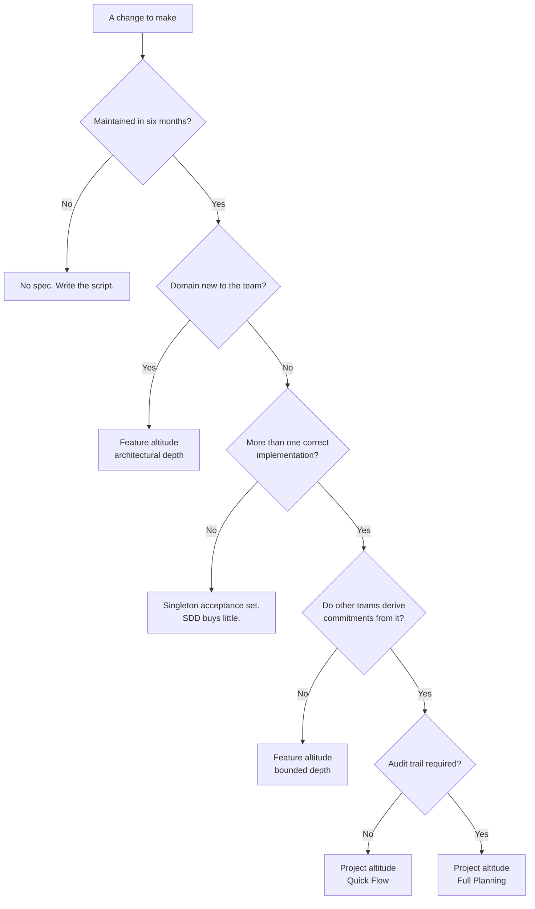

# "So SDD means we write more documents."

If anyone leaves believing that, today failed.

Not partially. The person who believes it will try it once, find it slow, and conclude the whole thing is bureaucracy, and they will be harder to convince the second time than they were this morning.

<!--
Say the failure condition out loud. It is stated in the training's own design
document as the criterion by which the day is judged, and naming it here tells
the room that the last forty-five minutes are not a disclaimer.
-->

---

# Anti-patterns · the specs themselves

| Anti-pattern | Looks like | Healthy counterpart |
|---|---|---|
| **Spec theater** | A document that cannot be wrong | Module 1: the testability test |
| **Over-specification** | The spec costs more than the code | Module 1: the precision budget |
| **Altitude confusion** | A task where a spec belongs | Module 2: the depth dial |
| **Restatement** | The same constraint in eleven files | Module 1: reference over restatement |

Each of these has a counterpart you already met. None of them is new material. This is a recognition exercise.

<!--
The right-hand column is the point of the table. An anti-pattern with no
counterpart is a scolding; an anti-pattern traced back to a practice is a
diagnostic.
-->

---

# Anti-patterns · the process around them

| Anti-pattern | Looks like | Healthy counterpart |
|---|---|---|
| **Spec drift** | Spec and code diverge, silently | Module 4: definition of done |
| **Retro-spec** | Spec patched at PR time to match the build | Module 4: the spec changes *first* |
| **Ceremonial gate** | A gate nobody can fail | Module 2: size the artifact to the change |
| **Big-bang brownfield spec** | Six months specifying code nobody is changing | Module 5: spec the delta |
| **Regeneration as review substitute** | "The spec is right, so skip the diff" | Module 4: code review *gains* a spec review |

The last two are the expensive ones. One wastes a quarter; the other ships security defects.

<!--
Retro-spec and drift produce the same diff -- that was module 4's slide, and
this is where the room should recognise it as a named thing rather than a
subtlety.
-->

---

# Spotting them in your own team

Every anti-pattern above is obvious in someone else's process. Three questions that make them visible in yours.

  

    
1 · When did a spec last get rejected?

    
If the answer is "never", the gate is ceremonial. A check nothing has ever failed is not a check.

  

  

    
2 · Which changed first, the spec or the code?

    
Ask it about last week's actual PRs, not about the policy. Retro-spec and correction produce the same diff.

  

  

    
3 · Could you delete the spec and lose anything?

    
If nobody would notice, it was documentation of a decision rather than the decision itself, and it will drift, because nothing depends on it.

  

All three are answerable in ten minutes from your own repository. None requires anyone's permission.

<!--
Question 1 is the sharpest and the most uncomfortable. Most teams that adopt a
review gate never fail one, and read that as evidence the process is working.

Question 3 is the deletion test pointed at the spec instead of the code, which
is worth saying out loud -- it is the morning's question turned around.
-->

---

# When NOT to do SDD

  

    
One-off scripts

    
Nobody maintains it. Write the script.

  

  

    
Exploratory prototypes

    
You do not yet know what you are building. Specs slow down the finding out.

  

  

    
Stable finished systems

    
Not changing. A parallel spec is overhead with no benefit.

  

  

    
Spikes

    
The artifact shrinks to a sentence. <b>The gate does not disappear.</b>

  

A participant who cannot name three cases where SDD is overhead has not understood it.

<!--
The spike wording is deliberate and it matters: the room watched a tool classify
and gate a spike in module 2 this morning. A flat "don't do SDD for spikes" here
reads as a contradiction seven hours later, and someone will say so.
-->

---

# Where SDD buys nothing

The strongest objection of the day, and it is correct in its own domain.

"If the spec is complete enough to regenerate from, it contains everything the code contained. You have rewritten the program in English: longer, ambiguous, no compiler. We tried this. It was called MDA."

The answer turns on one distinction: a spec does not determine <b>the implementation</b>. It determines the <b>acceptance set</b>: the set of implementations that would be correct.

  

    
Set has many members

    
The spec is strictly smaller than the code. The difference is the precision budget. SDD pays.

  

  

    
Set is a singleton

    
A dense algorithmic kernel. A protocol implementation. A hot path where one shape performs. The spec converges on the code, and <b>the objector is right.</b>

  

<!--
MDA failed because it forced the acceptance set to a singleton, which does make
the model grow into the program. SDD keeps it plural deliberately, and pays for
that with nondeterminism and with a residue only code review finds.

Concede the singleton column out loud and without hedging. An instructor who
tries to win the whole field loses the senior for the rest of the day; an
instructor who names the limit is believed about everything else.
-->

---

# Which altitude, what depth

<!--
This is the slide people photograph. Pause and let them.

Every input has been earned earlier -- nothing appears here for the first time.
Lifespan and compliance come from module 2's reversibility asymmetry. Domain
novelty from module 2's elicitation. The acceptance-set branch from the previous
slide. If you find yourself explaining an input here, it was under-taught earlier.
-->

---

# Reading it · a worked example

"Add a per-customer rate limit to the API."

  
<b>Maintained in six months?</b> Yes. It is core platform behaviour.

  
<b>Domain new?</b> No. The team has done rate limiting before.

  
<b>More than one correct implementation?</b> Yes: fixed window, sliding window, token bucket all satisfy "reject over the limit", and they behave differently at the edge.

  
<b>Other teams derive commitments?</b> Yes. The client SDK and the support runbook both encode the behaviour.

  
<b>Audit trail required?</b> No.

<b>→ Project altitude, Quick Flow.</b> Not because it is big. Because other people will build on the answer.

<!--
That last sentence is the whole flowchart in one line. Size is not an input;
reversibility is.

This is also the exact change from module 4's PR demo -- the one where every
test stayed green while burst behaviour changed. Point at that if the room needs
to see why "more than one correct implementation" is the branch that matters.
-->

---

# The tool landscape

| | Optimises for | Weight |
|---|---|---|
| **BMAD** | Traceability, audit trails, multi-team coordination | Heavy, with a Quick Flow dial |
| **Superpowers** | Feature-level loop inside an editor session | Light, with an architectural dial |
| **GitHub Spec Kit** | A vendor-neutral `/specify → /plan → /tasks` flow | Medium |
| **Kiro** | Spec-driven work inside an IDE | Medium |
| **ECC** | A skills-and-agents harness spread across many editors | Medium; it is a harness, not a spec method |
| **Plain markdown + git** | Nothing, and it always works | As light as you make it |

The last row is not a joke. Every principle today works with two markdown files and a review habit.

<!--
Spec Kit is on this slide despite not being taught, because the room has heard
the term and omitting it invites a Q&A ambush. One sentence is enough.

ECC is on the slide with a deliberate qualifier. It is a harness that distributes
skills and agents -- agent INSTRUCTION files, with no goal, no constraints and no
acceptance criteria. Useful, and not a spec method. If someone offers it as one,
that is module 1 slide 8's altitude confusion with a new costume.

The last row is the honest close: nothing today required a vendor.
-->

---

# What we did not cover

| Deferred | Where it lives |
|---|---|
| CI enforcement of spec-code linkage | The Lab 4 handout has a reference slide |
| Multi-agent orchestration | Named on the landscape slide, not taught |
| Organisational rollout, mandates | Deliberately out of scope (see the next slide) |

Said out loud so that a question about any of these reads as a boundary rather than an omission.

<!--
There is no part two. These are dropped, not postponed, and each has a resting
place. Saying so is more honest than implying a sequel that will not happen.
-->

---

# Monday · what to actually do

  

    
If you are early in your career

    
Take the next ticket you are given and write the <b>five questions</b> from module 2 before writing any code. Send them to whoever wrote the ticket.

  

  

    
If you are experienced

    
Run the <b>deletion test</b> on one module you own. Name one thing you would need that is written down nowhere. Write that one thing down.

  

  

    
If you lead a team

    
Add one line to your definition of done: <b>behaviour changes require a spec change, and the spec changes first.</b> Nothing else. Not a template, not a tool.

  

<!--
One action each, and all three are free. Do not offer a menu -- a menu produces
a decision, and a decision at 17:00 produces nothing.

The third is the only one that needs anyone else's agreement, which is why it is
one line rather than a process.
-->

---

# Adopt what pays for itself first

The costs and the benefits of SDD do not always land on the same person. Sort by who pays.

  

    
Self-paying: adopt unilaterally, tomorrow

    
The five questions · acceptance criteria that can fail · an executable plan · a delta-spec before a legacy change. Each repays you inside the same task.

  

  

    
Team-paying: needs a shared norm

    
Spec as definition of done · spec review alongside code review. Do not adopt these alone; you will pay a visible tax for an invisible benefit.

  

  

    
Org-paying: needs a mandate and a budget

    
Traceability CI · project-altitude artifacts · audit trails. Never mandate these downward without also moving whatever measures the mandated team.

  

<!--
This is the slide that prevents the most common failure after a good training:
one convinced person tries to institute a team-paying practice alone, loses the
argument in a standup, and concludes the method was naive.

Ceremonial gates form when the mandating party does not pay. That is the
mechanism, and it is worth naming.
-->

---

# One question, three jobs

| Where | The question | What it decided |
|---|---|---|
| Module 0 | Name one thing you'd need that the spec doesn't say | Is the spec the source, or is the code? |
| Module 4 | Would fixing the spec and regenerating remove this defect? | Spec defect, or implementation defect |
| Module 5 | Where does it fail hardest here? | What archaeology recovers first |

Not <s>is this code correct?</s> 
<b>Where does the truth about this system live?</b>

<!--
Close on the same question the day opened with. If only one thing survives the
week, this is the one worth surviving -- the practices are all downstream of it.

Then Q&A. Do not add a summary slide after this one; the callback IS the summary.
-->
